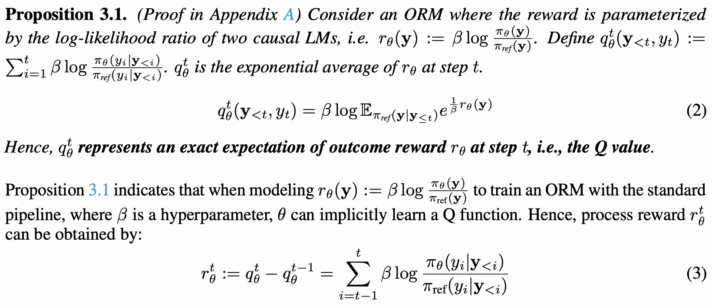
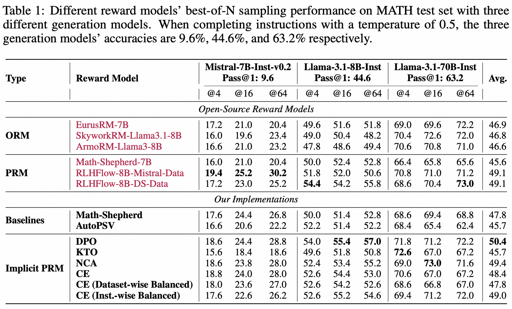
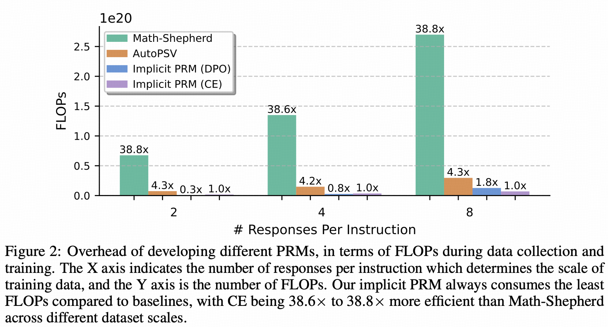
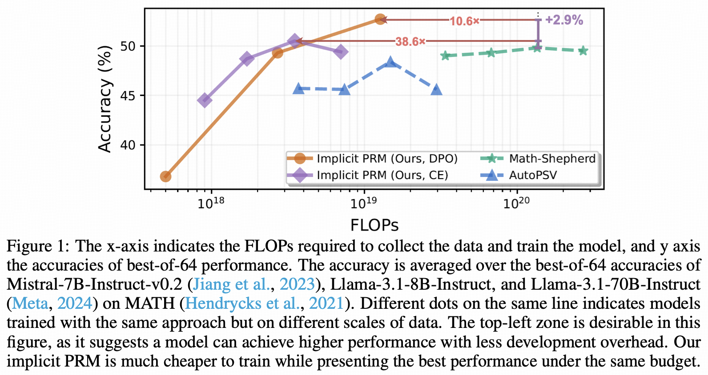
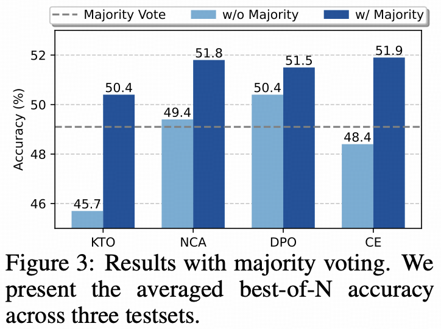
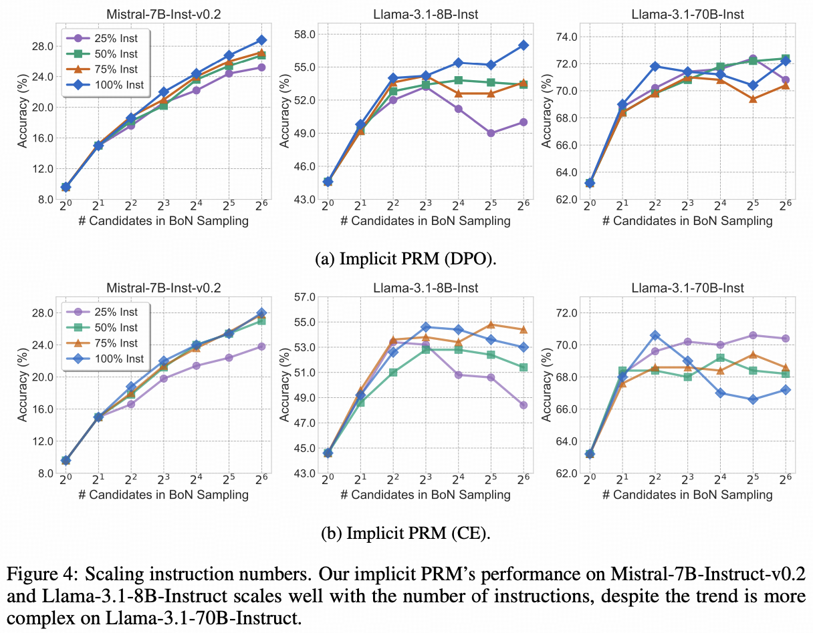
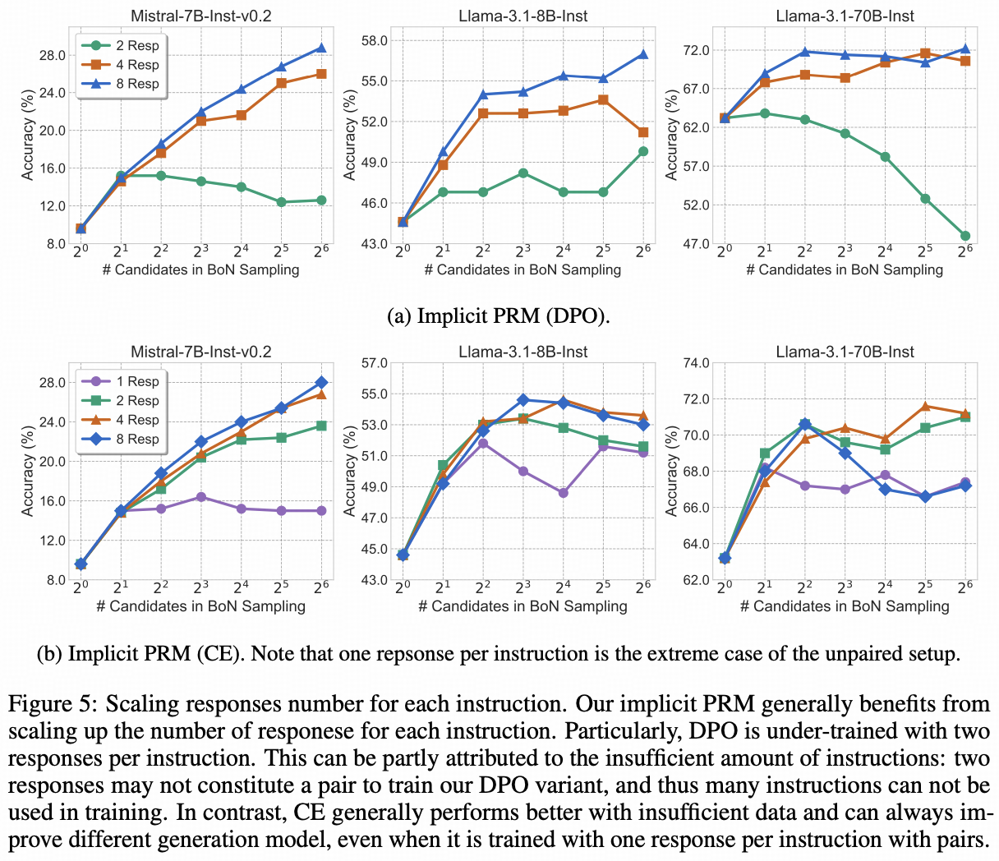

<div align="center">


**Free Process Rewards without Process Labels**

<p align="center">
    <a href="#links"> Links</a> •
    <a href="#introduction"> Introduction</a> •
    <a href="#evaluation">Evaluation</a>
</p>


</div>


# Update News
- **[2024/12/02]** Our [paper](https://arxiv.org/abs/2412.01981) comes alive! We release our [implicit PRMs](https://huggingface.co/collections/Windy0822/implicitprm-675033e6b3719046c13e2e48) trained with DPO and CE respectively, **the best PRMs trained from Llama-3.1-Instruct to date**, and we also open-source the corresponding [training dataset](https://huggingface.co/datasets/Windy0822/ultrainteract_math_rollout), the **response-level** rollouts to UltraInteract instructions sampled by Llama-3.1-8B-Instruct.

# Links
- 📜 [Paper](https://arxiv.org/abs/2412.01981)
- 🤗 [Implicit PRM](https://huggingface.co/collections/Windy0822/implicitprm-675033e6b3719046c13e2e48)
- 🤗 [Response-level Dataset](https://huggingface.co/datasets/Windy0822/ultrainteract_math_rollout)

# Introduction

Training a PRM with conventioanal approaches requires labels annotated at every intermediate step, presenting significant challenges for both manual and automatic data collection.

In contrast, we show that an *implicit PRM* can be obtained *at no additional cost*, by simply training an ORM on the cheaper *response-level labels*. The only assumption is to parameterize the outcome reward as the log-likelihood ratios of the policy and reference models $r_\theta (\mathbf{y})=\beta \log \frac{\pi_\theta(\mathbf{y})}{\pi_{\text{ref}}(\mathbf{y})}$, which can be optimized regardless of the specific choice of loss objectives. Specifically, we have the following proposition:



Notably, this conclusion still holds when $y_t$ represents the $t$-th token rather than step $t$.
Therefore, **we can indeed obtain PRMs, or more fine-grained token-level RMs, simply by collecting response-level data and training an ORM, without any burden of annotating step labels.** We dub the PRM derived from such outcome reward modeling as an **Implicit PRM**.

# Evaluation

We evaluate Implicit PRM with best-of-N sampling. We generate testsets on MATH500 with three generation models. 
We implement Math-Shepherd and AutoPSV and train on [our dataset](https://huggingface.co/datasets/Windy0822/ultrainteract_math_rollout). We also compare to six off-the-shelf ORMs and PRM, including the (previous) SOTA PRMs of Llama-3.1 class, RLHFlow/Llama3.1-8B-PRM-Mistral-Data and RLHFlow/Llama3.1-8B-PRM-Deepseek-Data.
We instantiate our proposition using various reward modeling objectives, including DPO, NCA, KTO, and cross-entropy (CE). Particularly, given esponse-level label $l$, CE is implemented as follows:

```math
\mathcal{L}_{CE} = l \cdot \log \sigma \left( \beta \log \frac{\pi_\theta(\mathbf{y})}{\pi_\text{ref}(\mathbf{y})} \right) + (1-l) \cdot \log\left[ 1 - \sigma \left( \beta \log \frac{\pi_\theta(\mathbf{y})}{\pi_\text{ref}(\mathbf{y})} \right) \right]
```

## Various implicit reward modeling objectives outperform baselines



It is noteworthy that our implicit PRM (DPO) achieves the overall best performance, surpassing the previous SOTA of this backbone. Our implicit PRM (CE) also outperforms all baselines except RLHFlow-8B-Mistral-Data and RLHFlow-8B-DS-Data. This indicates the potential in empowering real-world applications where pairwise data is hard to collect.

## Our Implicit PRMs reduce the overhead of data collection and training by 38.8×



## Our Implicit PRM achieves better trade-offs between performance and efficiency




##  CE loss become the most effective when augmented with majority voting



KTO and CE gain the most from the integration, both of which fail to surpass majority voting alone but outperforms it through weighted best-of-N. It is also noteworthy that CE loss becomes the most effective when augmented with majority voting, once again demonstrating its potential.


## Scaling Up Instructions and Responses can Improve Implicit PRMs
- Both scaling instructions and responses consistently improve the performance of our implicit PRM.
- Compared to instructions, scaling up responses seems to be more influential on implicit PRMs, as reflected by the larger performance variations between the minimum and maximum data setups.
- **DPO requires more data to obtain a descent performance than CE.** DPO is under-trained with two responses per instruction, which can be partly attributed to the insufficient amount of instructions: two responses may not constitute a pair to train our DPO variant, and thus many instructions can not be used in training.
In contrast, CE generally performs better with insufficient data and can always improve different generation model, even when it is trained with one response per instruction with pairs, the extreme case of the unpaired setup. This presents a huge advantage in real-world data scarcity scenarios.





# Citation
If you find our model, data, or evaluation code useful, please kindly cite our paper:
```bib
@misc{yuan2024implicitprm,
      title={Free Process Rewards without Process Labels}, 
      author={Lifan Yuan and Wendi Li and Huayu Chen and Ganqu Cui and Ning Ding and Kaiyan Zhang and Bowen Zhou and Zhiyuan Liu and Hao Peng},
      year={2024},
      eprint={2412.01981},
      url={https://arxiv.org/abs/2412.01981}, 
}
```